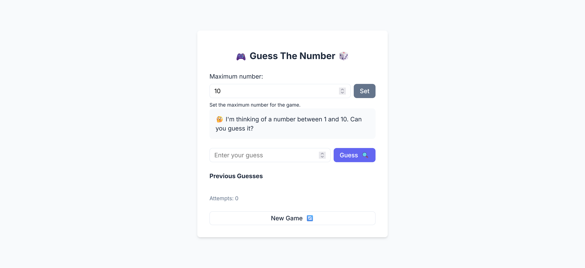
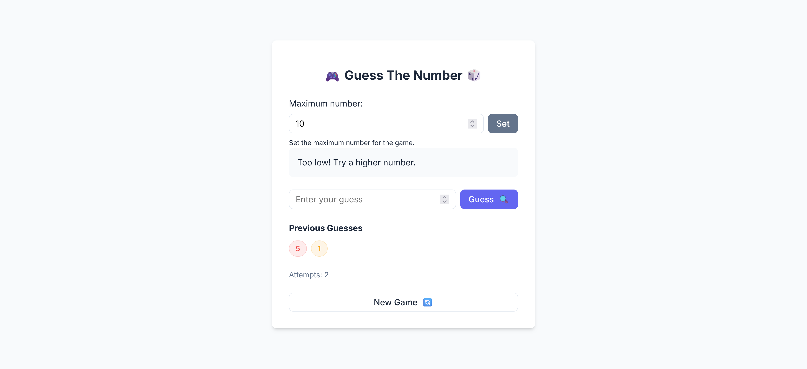
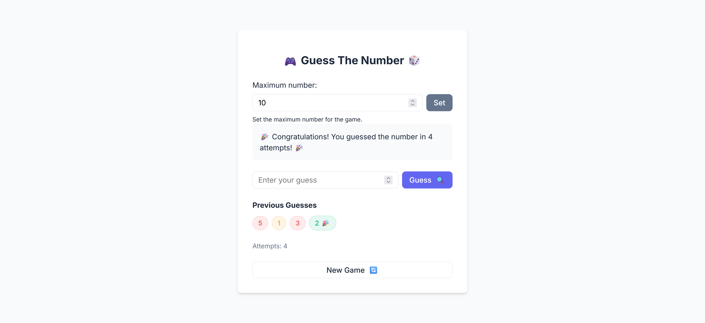

# 🎮 Guess The Number 🎲

Welcome to **Guess The Number**, a fun and interactive number guessing game! 🎉

## 📜 Project Overview

In this game, you have to guess the number that the computer is thinking of within a specified range! The number changes each time you start a new game, so the fun never stops! 🎯

## 🚀 Features

- **Adjustable Difficulty**: Set the maximum number to define the range for each game. 🏞️
- **Real-time Feedback**: Receive hints whether your guess is too low or too high! ⬆️⬇️
- **Game History**: Keep track of all your previous guesses. 📜
- **Attempts Counter**: Track how many attempts it takes to guess the correct number. ⏱️
- **Start a New Game**: Ready for a new challenge? Just click the "New Game" button and you're good to go! 🔄

## 🛠️ Technologies Used

- **HTML5**
- **CSS3**
- **JavaScript**

## 🧑‍💻 How to Play

1. Set the **maximum number** for the game (the range will be from 1 to your chosen number). 📈
2. Enter your guess in the input box and hit the **Guess** button. 🔍
3. You'll receive feedback on whether your guess is too **low** or too **high**. 🎯
4. Keep guessing until you get it right! 🎉
5. When you guess correctly, the game will congratulate you and track how many attempts it took. 🏆
6. Click the **New Game** button to start a fresh round! 🔄

## 🎯 Game Rules

- The computer picks a random number between 1 and the maximum number you set. 🧮
- You need to guess the number.
- For each guess, the game will tell you if the number is too high or too low. 📊
- The game ends when you guess the correct number! 🎯

## 🔧 Getting Started

To run the game on your local machine:

1. Clone the repository:
   ```bash
   git clone https://github.com/yourusername/guess-the-number.git
   ```
2. Navigate to the project directory:
   ```bash
   cd guess-the-number
   ```
3. Open the `index.html` file in your browser:
   ```bash
   open index.html
   ```

## 🖌️ Preview

Here is a preview of the app:





